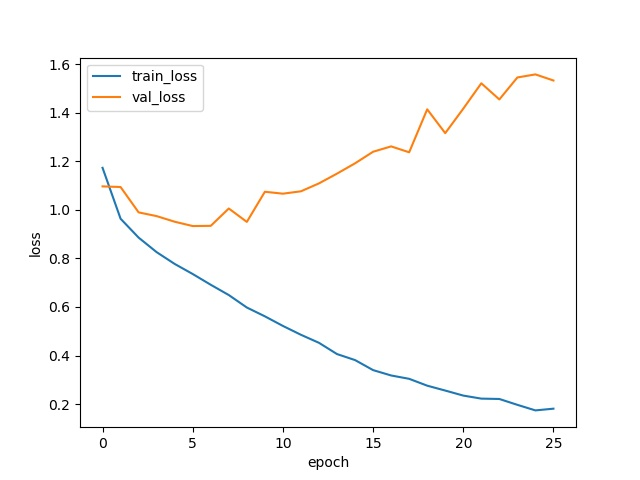

# CILPA
This directory contains the code and result for the CILPA of our report.

## results
Loss plot:

Accuracy on val set:

The final accuracy on the test set is 0.6698 (2404 / 3589).

## Files
- main.py: all the experiment code
- plot.py: extract results from log and make plot
- Resnet18_128.log: experiment result(original log)
- results.json: structured results
- train/, val/, test/ : contains the colored images from the train/val/test set. Here we only put a few example imgs.

For the colorazation part, we used [Labeled Faces in the Wild Home(LFW)](http://vis-www.cs.umass.edu/lfw/) as dataset to train the [Pix2pix](https://github.com/junyanz/pytorch-CycleGAN-and-pix2pix) algorithm. For details, please refer to the hyperlinks.